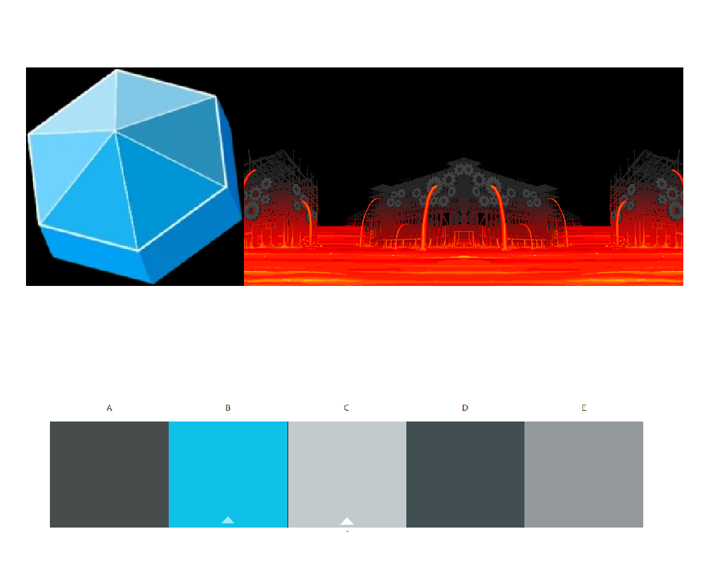
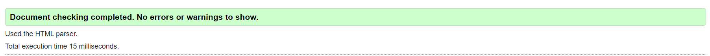

# Grist Grinder (clicker)
Titel: grist Grinder

Tagline: A clicker game based on Dave's assault on the stock market

URL: https://tomtenpim.github.io/wu1-Clicker-TomtenPim/ 

Git: https://github.com/TomtenPim/wu1-Clicker-TomtenPim/

Simon Mikael Ågren | 2022-04-14

## Inledning

Här beskriver du kortfattat arbetets syfte/mål, arbetssätt, genomförande.

Målet med denna uppgift far att ta en färdig mall och sedan ändra css, html och javascript för att skapa ett nytt clicker spel

## Bakgrund

Redovisa arbetets olika delar. Så att läsaren förstår vad du gjort och hur.

Jag skapade denna moodboard baserad på meny stilen av Homestuck. Jag kollade upp deras policy på skapande av dess egendom och det var okej att använda bara man inte tjänade pengar på det. 

Då jag vitse att det var okej att fortsätta med min ide skapade jag denna svg fil  Som jag bytte ut dinousaurieskallen med. Jag ändrade backgrund och färger samt lade in nya uppgraderingar. 

Den har validerats och paserade senatse check utan fel
 

## Positiva erfarenheter

Html och CSS har jag inte stött på några stora problem vilket var trevligt. Uppgifter i helhet har också vart kul att göra.

## Negativa erfarenheter

I JavaScript stötte jag på ett flertal problem med hur JS läser och updaterar variabler. Men med omskrivningar har jag lyckats lösa dessa problem.

## Sammanfattning

Projektet var mycket underhållande. Jag har lärt mig om JavaScript implimentering på hemsidor samt hur man skriver i javaScript.

Jag är mycket nöjd med slutresultatet. Rent vissuelt liknar spelet det jag vill och spelet, trotts mina ändringar i koden, fungerar utan problem. 

Något som skulle kunna arbetas vidare på är fler uppgradering och achivements samt intresantare grafiska reaktioner på uppgraderingar.